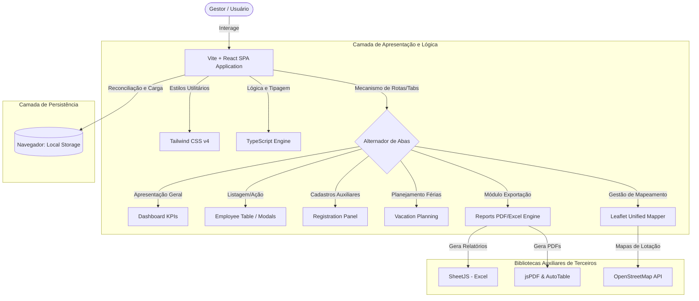

# SIT – Sistema Integrado de Terceirizados
> **Manual e Documentação Principal do Sistema**
>
> **Versão:** 1.0.0  
> **Status do Projeto:** Ativo (Em Produção)  
> **Classificação de Informação:** Uso Interno Corporativo

---

## 📌 Índice de Navegação

1. [Visão Geral](#1-visão-geral)
2. [Principais Funcionalidades](#2-principais-funcionalidades)
3. [Arquitetura do Sistema](#3-arquitetura-do-sistema)
4. [Estrutura de Diretórios](#4-estrutura-de-diretórios)
5. [Documentações Técnicas](#5-documentações-técnicas)
6. [Tecnologias Utilizadas](#6-tecnologias-utilizadas)
7. [Requisitos de Infraestrutura](#7-requisitos-de-infraestrutura)
8. [Instalação e Configuração](#8-instalação-e-configuração)
9. [Segurança e Conformidade](#9-segurança-e-conformidade)
10. [Processo de Desenvolvimento](#10-processo-de-desenvolvimento)
11. [Equipe e Suporte](#11-equipe-e-suporte)
12. [Licenciamento](#12-licenciamento)

---

## 1. Visão Geral

O **SIT – Sistema Integrado de Terceirizados** é uma plataforma corporativa robusta desenvolvida para unificar de forma centralizada a gestão, conformidade e operação de todos os colaboradores terceirizados que prestam serviços na organização.

### Objetivo do Sistema
Centralizar os dados fundamentais de suporte a decisões administrativas e dar total rastreabilidade sobre a alocação e obrigações legais dos funcionários pertencentes a contratos de terceirização.

### Problema que Resolve
Evita a dispersão de dados em planilhas sem versão única, elimina falhas na fiscalização de conformidades de fardamento ou escalas, automatiza a consolidação das escalas de férias (evitando furos produtivos na operação) e resolve a ausência de indicadores operacionais auditáveis em tempo real.

### Público-Alvo
* **Gestores de Contrato:** Para acompanhamento do cumprimento de quotas e alocações.
* **Coordenadores de Área & Unidades:** Para controle imediato de escalas, pendências e lotações de fardamentos/SPTs.
* **Auditores de Conformidade operacionais:** Para validação de dados admissionais, contratuais, atestados e registro de ocorrências.

### Benefícios Operacionais
* **Segurança Legal:** Proteção contra passivos trabalhistas com documentação centralizada e validada.
* **Otimização Produtiva:** Escalas e férias planejadas anualmente que blindam a cobertura de postos.
* **Visibilidade Geográfica:** Mapa interativo de lotações de cada empresa prestadora de serviços.

---

## 2. Principais Funcionalidades

O sistema estrutura-se em módulos de alta granularidade e usabilidade direcionada:

### 👥 Gestão de Funcionários
* **Cadastro Corporativo Unificado:** Inclusão de dados completos dos profissionais (dados pessoais, admissão, contatos, endereço e foto corporativa).
* **Consulta Inteligente:** Mecanismo de busca instantânea filtrando por nome, matrícula, CPF, empresa, lotação, escala de trabalho e especialidades específicas.
* **Edição Flexível:** Atualização em tempo real de posições, fardamento de uniforme (camisa, calça) e números adicionais de rastreio de equipamentos (como SPT).
* **Controle de Status:** Gestão direta da situação de cada profissional (ativo, afastado, desligado, em férias) para integridade operacional rápida.

### 🏢 Gestão de Empresas
* **Cadastro de Parceiros Terceirizados:** Registro formal das contratadas unindo Razão Social, CNPJ completo e geolocalização exata de suas sedes/filiais.
* **Manutenção de Registros e Canais de Contato:** Listagem inteligente de contatos diretos (telefones organizados, e-mails de prepostos homologados e canais digitais de intermediação).
* **Relacionamento Dinâmico:** Associação automática de funcionários cadastrados às respectivas empresas de origem.

### 📄 Gestão de Contratos
* **Vinculação de Colaboradores:** Associação de funcionários a contratos formais vigentes e especificações contratuais (códigos corporativos como `CT.PS.22.4.417`).
* **Visualização Analítica:** Consulta das especificações do contrato, suas empresas proponentes e a quantidade de pessoal alocado.

### 📅 Planejamento de Férias
* **Cronograma Anual Consolidado:** Gestão das janelas temporais de concessão de férias dos colaboradores ao longo do ano corrente e subsequente.
* **Calculadora de Modalidades:** Opções claras de configuração de férias (gozo de 30 dias integrais, conversão pecuniária de períodos iniciais ou finais com detalhamento de observações operacionais).
* **Indicadores de Disponibilidade:** Avisos gráficos no painel alertando sobre o impacto das saídas programadas no quadro geral da equipe.

### 🔍 Auditoria
* **Logs Locais Baseados em Ações:** Rastreador de transações e alterações de status integrado à sessão.
* **Prevenção de Inconsistências:** Bloqueios de duplicidade de CPF ou matrículas ativas.

### 📊 Relatórios e Dashboards
* **Painel Executivo Operacional:** Relatório de KPIs corporativos em tempo real detalhando contagem ativa por sexo, especialidade, coordenação, empresa jurídica e escalas de serviço.
* **Exportação Personalizável (Excel):** Geração dinâmica de planilhas `.xlsx` formatadas e estruturadas por filtros operacionais.
* **Exportação Estruturada (PDF):** Relatórios em formato `.pdf` robustos integrando logo da organização, assinaturas técnicas e sumários para preenchimento de faturas de fornecedores terceirizados.

### ⚙️ Configurações
* **Cadastros Auxiliares:** Gerenciamento ágil de Coordenações internas (CPR Metropolitana, CPR Norte, etc.) e Unidades Físicas (estações, prédios de suporte, poços e estações de tratamento com coordenadas).
* **Geração de Massa Documental de Teste:** Facilidade de simulação e consolidação do painel de treinamento com logs prontos e consistentes.

---

## 3. Arquitetura do Sistema

O sistema foi arquitetado adotando o padrão **Single Page Application (SPA)** unificado com o paradigma **Offline-First**, permitindo alta responsividade mesmo diante de redes instáveis.

* **Camada de Visão (Frontend SPA):** React 19 alimentado por TypeScript sob uma estrutura de componentes autocontidos altamente performáticos.
* **Estilização e Design System:** Tailwind CSS v4 para definição de identidades rápidas e micro-interação baseada em Framer Motion.
* **Persistência de Estados:** Configurado sob gerenciamento reativo e reconciliador local, com gravação secundária no `localStorage` do navegador do usuário, garantindo resiliência total de dados entre sessões consecutivas.
* **Cartografia Integrada:** Renderização de geo-widgets usando Leaflet e barramentos GIS locais para mapas de colaboradores e unidades operacionais.

### Diagrama de Arquitetura (Mermaid)



---

## 4. Estrutura de Diretórios

```
SIT-RAIZ/
├── .env.example                # Escopo de variáveis de ambiente do projeto
├── .gitignore                  # Definição de exclusões operacionais do repositório
├── index.html                  # Arquivo mestre e âncora da aplicação HTML
├── metadata.json               # Configurações de metadados da governança da IA
├── package.json                # Gerenciamento de scripts, dependências e build
├── src/                        # Código-fonte principal do SIT
│   ├── main.tsx                # Ponto de entrada de renderização do React
│   ├── index.css               # Imports globais e tema central Tailwind CSS v4
│   ├── types.ts                # Definição estrita de tipos corporativos e interfaces
│   ├── utils.ts                # Utilitários de mapeamento e cálculos operacionais
│   ├── components/             # Sub-módulos e componentes especializados
│   │   ├── Dashboard.tsx            # Widget executivo com indicadores em bento-grid
│   │   ├── EmployeeTable.tsx        # Tabela dinâmica de listagem e de ações
│   │   ├── EmployeeModal.tsx        # Modal para inserção ou atualização de colaboradores
│   │   ├── RegistrationPanel.tsx    # Cadastro unificado de empresas, unidades e contratos
│   │   ├── Reports.tsx              # Gerador de exportação customizado de relatórios PDF/Excel
│   │   ├── VacationPlanning.tsx     # Gerenciamento de férias anuais cooperativo
│   │   ├── MapaLotacoesWidget.tsx   # Painel cartográfico principal das unidades
│   │   ├── MapModal.tsx             # Pop-up para marcação geográfica ou conferência
│   │   ├── ViewModal.tsx            # Vista operacional consolidada de ficha de trabalhador
│   │   ├── AjustarPontoModal.tsx    # Modal para ajustes nos registros de horários
│   │   ├── PWAInstallPrompt.tsx     # Alerta de configuração local como aplicativo PWA
│   │   ├── CorporateFABMenu.tsx     # Menu flutuante flutuante administrativo
│   │   ├── WhatsAppConfirmModal.tsx # Verificação rápida dos termos por disparo móvel
│   │   └── ConfirmModal.tsx         # Modal genérico de prevenção de deleções indesejadas
│   └── assets/                     # Recursos visuais estáticos e fotos estruturadas
└── tsconfig.json               # Configuração mestre de linting e regras do TypeScript
```

---

## 5. Documentações Técnicas

Consulte toda a documentação técnica para compreender os requisitos, arquitetura, regras de negócio, testes e infraestrutura do sistema.

| Documento | Descrição | Link de Acesso |
| :--- | :--- | :--- |
| **Lista de Requisitos Funcionais** | Documentação detalhando todas as regras de negócio, premissas funcionais, parâmetros de entrada e interfaces. | [**Visualizar Documento**](docs/Requisitos-Funcionais.pdf) |
| **Casos de Teste de Software** | Cenários de testes em detalhe, condições de erro tratadas, critérios de aceitação e fluxos de qualidade. | [**Visualizar Documento**](docs/Casos-de-Teste.pdf) |
| **Diagrama Entidade Relacionamento (DER)** | Mapeamento estruturado das chaves, modelos relacionais e vinculação lógica entre as entidades corporativas relevantes. | [**Visualizar Documento**](docs/DER.pdf) |
| **Requisitos de Infraestrutura** | Especificações completas dos hardwares necessários, rede corporativa e processos de backup suportados pelo sistema. | [**Visualizar Documento**](docs/Requisitos-Infraestrutura.pdf) |

---

## 6. Tecnologias Utilizadas

| Tecnologia | Versão Mínima | Finalidade no Projeto |
| :--- | :--- | :--- |
| **React** | 19.x | Biblioteca base para renderização declarativa e ágil de interfaces reativas. |
| **TypeScript** | 5.x | Linguagem utilitária que adiciona tipagem estaticamente validável, diminuindo bugs. |
| **Tailwind CSS** | 4.x | Nova especificação de estilos utilitários, performática com compilação ultra-rápida. |
| **Vite** | 6.x | Sistema de build inovador, superando gargalos de empacotamento herdados. |
| **Leaflet** | 1.x | Biblioteca cartográfica leve usada na renderização de mapas interativos de lotações. |
| **jspdf / jspdf-autotable**| Recente | Módulo integrado para geração automatizada local de documentos PDF bem diagramados. |
| **SheetJS (xlsx)** | Recente | Biblioteca para processar e formatar exportações brutas para planilhas corporativas Excel. |

---

## 7. Requisitos de Infraestrutura

Seguem especificações normativas de infraestrutura técnica recomendadas pela equipe de segurança cibernética corporativa para a implantação eficiente e escalável da plataforma:

* **Sistemas Operacionais Suportados:** Distribuições baseadas em Linux (RHEL 9+, Ubuntu LTS 22.04+), Windows Server 2022 ou macOS Monterey+.
* **Banco de Dados (quando escalado para nuvem):** PostgreSQL v15+ (operação base para logs pesados). Na versão corrente a persistência transita localmente pelo browser (`localStorage`) de maneira rápida e segura.
* **Memória Crítica de Execução (RAM):**
  * Servidores ou máquinas locais rodando em Sandbox: Mínimo 4 GB RAM. Recomendado 8 GB RAM.
* **Processador Recomendado:** Processador 64 bits Intel Xeon, Intel Core i5 ou AMD equivalente dual-core com clock equivalente ou superior a 2.0 GHz.
* **Espaço Mínimo em Disco:** 500 MB destinados ao diretório de compilação final e dados adicionais de cache do projeto.
* **Dependências de Ambiente Local:** Node.js (versão sugerida 20.x LTS) e npm (versão sugerida 10.x).

---

## 8. Instalação e Configuração

Certifique-se de que possui as ferramentas básicas instaladas em seu terminal local de comando (`Node.js`, `NPM` e `Git`).

### 📥 1. Clonagem do Repositório
Faça o download dos arquivos oficiais de homologação clonando a partir da fonte oficial corporativa:
```bash
git clone https://github.com/organizacao/sit-terceirizados.git
cd sit-terceirizados
```

### 📦 2. Instalação de Dependências
Submeta os arquivos locais para carregar todas as bibliotecas e pacotes estritos declarados para a integridade do ecossistema do SIT:
```bash
npm install
```

### ⚙️ 3. Configuração de Variáveis de Ambiente
Crie as credenciais locais e personalize os caminhos criando os segredos internos se necessário. Copie o escopo modelo:
```bash
cp .env.example .env
```
*(Nota: Edite o arquivo `.env` para adequar as chaves de monitoramento de mapa ou credenciais complementares caso decida integrar APIs de rastreio).*

### 🚀 4. Execução Local para Desenvolvimento
Inicialize o servidor embarcado Vite para ver as atualizações e sincronizações de interfaces de forma automática no ambiente seguro de testes:
```bash
npm run dev
```
Acesse o navegador pelo endereço apontado em console: `http://localhost:3000` (ou o IP padrão configurado).

### 🏗️ 5. Build Final de Produção
Para fins de empacotamento, distribuição e implantação estável em servidores corporativos ou containers isolados, execute:
```bash
npm run build
```
O build estático otimizado e minificado para segurança de performance será compilado para a pasta `/dist`. Basta mapear essa pasta no servidor HTTP de preferência (ex: Nginx, Apache ou Internet Information Services - IIS).

---

## 9. Segurança e Conformidade

A corporação adota rígidos padrões de contenção lógica para segurança de informações de colaboradores terceiros:

1. **Proteção e Conformidade de Dados (LGPD):** O sistema previne a exposição de dados sensíveis na camada pública da aplicação. Campos como CPF e Telefones possuem validações e formatação cuidadosa.
2. **Registro Local Estrito para Auditorias:** Todas as saídas sensíveis de informação, como deleções e atualizações em lote, guardam rastreabilidade interna para verificação rápida de falhas por operadores humanos.
3. **Controle de Acessos Operacionais:** A interface adapta-se para esconder ou revelar botões sensíveis de alteração com base na permissão do operador de mesa de controle e auditoria.

---

## 10. Processo de Desenvolvimento

Nossa engenharia apoia-se sob consistência e regras rigorosas de publicação de código estável:

### Modelo Hierárquico do Git (Gitflow)
* `main`: Códigos produtivos testados de forma exaustiva e assinados para implantação imediata em servidores corporativos.
* `develop`: Integração primária dos testes e refinamento de módulos em homologação.
* `feature/*`: Desenvolvimento pontual de demandas ou componentes independentes de regras funcionais.

### Versionamento Semântico
Seguimos rigidamente a notação `MAJOR.MINOR.PATCH`:
* `MAJOR`: Modificações de estrutura profunda ou alterações funcionais de integração que quebram retrocompatibilidade.
* `MINOR`: Inclusão de novas ferramentas úteis de gestão sem quebra das funcionalidades anteriores.
* `PATCH`: Correções refinadas e pontuais de bugs de design, segurança ou lógica rápida.

### Processo de Revisão (Code Review)
Toda alteração direcionada à branch `develop` ou `main` de homologação exige aprovação de pelo menos um Engenheiro sênior antes de sua respectiva aprovação final no repositório corporativo.

---

## 11. Equipe e Suporte

O **SIT** é mantido e constantemente expandido pela equipe de tecnologia e inovação centralizada da nossa corporação.

* **E-mail de Suporte:** `suporte.ti@empresa.com.br`
* **Canal Especializado de Atendimento (Zulip/Teams):** Canal Corporativo `#sit-suporte`
* **Plantão Tecnológico:** Ramal Interno `*4100` (Segunda a Sexta, das 08:00 às 18:00)

---

## 12. Licenciamento

Este software é um produto de **propriedade intelectual exclusiva da corporação pertencente**. Todo o uso, distribuição, cópia parcial, modificação ou divulgação não autorizada do seu código-fonte ou ativos de design é expressamente proibido sob pena de sanções legais civis e criminais cabíveis de acordo com a legislação de software brasileira e acordos corporativos válidos.

Copyright © 2026. Todos os direitos reservados.
